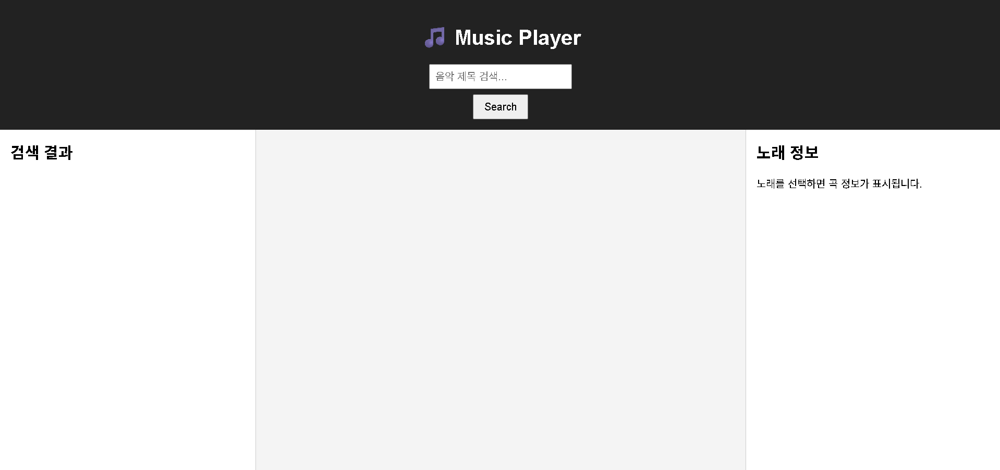

# 🎵 Music Player App

**🔗 배포 링크**: [https://tranquil-meerkat-907a71.netlify.app/](https://tranquil-meerkat-907a71.netlify.app/)

React로 제작된 심플하고 직관적인 음악 플레이어 앱입니다. iTunes API를 이용해 음악을 검색하고, 미리 듣기, 재생/다음곡/반복 기능, 진행 바 및 곡 정보 표시 등을 제공합니다.

---

## 🚀 주요 기능

- 🔍 **음악 검색**: iTunes API를 통해 실시간 검색
- ▶️ **음악 재생**: 선택한 곡 미리 듣기 (Preview)
- ⏭️ **다음곡 재생**: 현재 곡 기준 다음 검색 결과 재생
- 🔁 **반복 재생**: 반복 여부 토글
- 🔊 **볼륨 조절**: 슬라이더로 볼륨 조절 가능
- 📊 **진행 바**: 실시간 재생 진행률 표시
- 🕘 **시간 표시**: 현재 재생 시간 및 전체 시간 표시
- 💽 **곡 정보 표시**: 아티스트, 장르 등 세부 정보 출력
- 📱 **반응형 UI**: 모바일 환경에서 검색 결과 토글 가능

---

## 🛠️ 사용 기술

- ⚛️ React
- 🪝 React Hooks (`useState`, `useEffect`, `useRef`, `useCallback`)
- 📡 axios - 외부 API 통신
- 🎧 iTunes Search API - 음악 검색 및 미리듣기
- 💅 CSS - 사용자 친화적인 UI 구성

---
